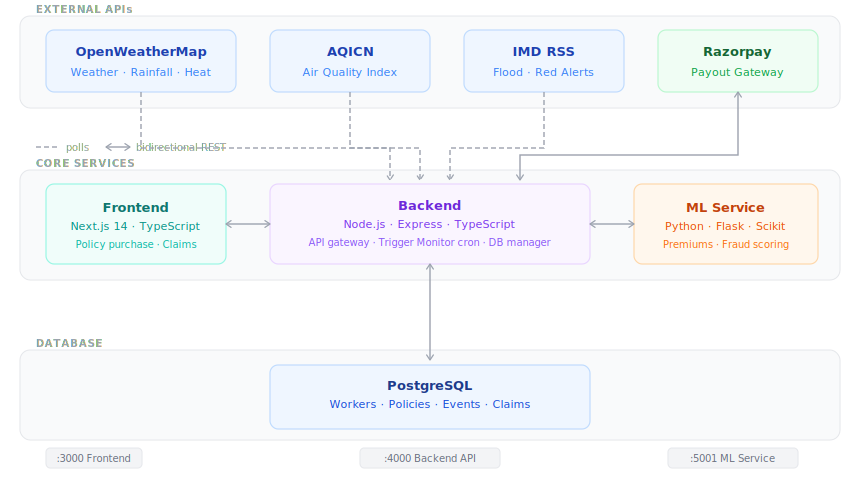

<div align="center">

# GigGuard

**AI-powered parametric income insurance for India's gig economy**

[](https://www.guidewiredevtrails.com/)
[](https://www.guidewiredevtrails.com/)
[](https://www.ey.com/)
[](https://www.niapune.org.in/)

[](https://nextjs.org/)
[](https://nodejs.org/)
[](https://python.org/)
[](https://postgresql.org/)
[](https://docker.com/)
[](https://razorpay.com/)

> *"23 million gig workers. Zero income protection. One platform to change that."*

[Demo Video](#) · [Live App](#) · [Slide Deck](#) · [Architecture Doc](docs/architecture.md)

</div>

---

## Table of Contents

- [The Problem](#-the-problem)
- [Our Solution](#-our-solution)
- [How It Works](#-how-it-works--end-to-end)
- [Architecture](#-architecture)
- [Parametric Trigger Engine](#-parametric-trigger-engine)
- [AI Premium Model](#-ai-powered-premium-model)
- [Fraud Detection](#-fraud-detection)
- [Business Viability](#-business-viability)
- [Future Roadmap](#-future-roadmap)
- [Tech Stack](#-tech-stack)
- [Local Setup](#-local-setup)
- [Team](#-team)
- [Documentation](#-documentation)

---

## 🚨 The Problem

India's gig economy is projected to surpass **23 million workers by 2030**. Food delivery partners, ride-share drivers, and last-mile logistics workers power the country's digital economy — yet they are legally classified as "partners," not employees. That single distinction strips them of every safety net formal employment provides.

The result is a silent financial crisis playing out with every monsoon, every heatwave, every sudden AQI spike.

| Disruption | Typical Income Impact | Current Safety Net |
|------------|----------------------|-------------------|
| Heavy rainfall / flooding | 20–30% monthly earnings lost | None |
| Severe air quality (AQI > 300) | Full-day income lost | None |
| Extreme heat (> 44°C) | Partial-day loss + health risk | None |
| Curfew / civil disruption | Complete loss for the day | None |

Existing insurance products demand paperwork, proof of loss, and processing times of days — completely incompatible with a workforce that earns and spends on a daily cycle.

**No product on the market today compensates a delivery partner for a single rain-induced income loss. GigGuard changes that.**

---

## 💡 Our Solution

GigGuard is a **zero-touch parametric insurance platform** for gig workers. Instead of requiring a worker to prove income loss, we let objective, real-world data do it for them.

When pre-defined thresholds are crossed — rainfall exceeding 15 mm/hr, AQI surging past 300, temperature hitting 44°C — the system automatically detects the disruption, identifies every affected policyholder, and **executes a payout without a single form being filed**.

This model shifts the burden of proof from the individual to the data: fast, fair, and tamper-proof.

```
Worker buys a policy (under 2 minutes)
          ↓
Backend monitor polls APIs every 15 minutes, 24/7
          ↓
Threshold breached → disruption_event created in DB
          ↓
All policyholders in affected zone identified
          ↓
Fraud score checked via Isolation Forest model
          ↓
Razorpay payout executed — worker notified instantly
```

---

## ⚙️ How It Works — End to End

**1 · Onboarding** — A worker signs up, enters their delivery zone, average weekly income, and working hours. No documentation required. Takes under two minutes.

**2 · AI Premium Quote** — Our ML service computes a real-time weekly premium based on zone risk, the 7-day weather forecast, and the worker's personal claims history. Workers in low-risk zones might pay as little as ₹45/week to protect ₹5,000 in earnings.

**3 · 24/7 Monitoring** — A background cron job polls OpenWeatherMap, AQICN, and IMD RSS alerts every 15 minutes for every active delivery zone. No human monitoring required.

**4 · Parametric Trigger** — When a threshold is crossed, the system writes a `disruption_event` record with zone, trigger type, severity, and timestamp. This becomes the single source of truth for every payout that follows.

**5 · Zero-Touch Payout** — All policyholders with an active policy in the affected zone receive:

```
Compensation = Average Hourly Income × Disruption Hours
```

**6 · Fraud Check** — Before every payout, the Isolation Forest model scores the claim. Clean scores pass instantly. Anomalous scores enter a lightweight manual review (target: < 5 minutes).

---

## 🏗️ Architecture

GigGuard runs as four independently containerized microservices orchestrated with Docker Compose — each with a clear boundary, enabling the team to develop, test, and scale them independently.



| Service | Technology | Role |
|---------|-----------|------|
| **Frontend** | Next.js 14, TypeScript | Worker onboarding, policy dashboard, claims history |
| **Backend** | Node.js, Express, TypeScript | Core API, business logic, trigger monitor cron job |
| **ML Service** | Python 3.9, Flask, Scikit-learn | Premium calculation, real-time fraud scoring |
| **Database** | PostgreSQL | Workers, policies, events, claims — single source of truth |

**Key design decisions:**
- The ML service is intentionally isolated from the Backend so complex AI logic never blocks core business transactions
- All external API calls originate from the Backend's Trigger Monitor — no service other than Backend touches external APIs
- PostgreSQL is the only stateful layer — all services are stateless and horizontally scalable

> For the full schema, API contract, and sequence diagrams see [Architecture Document](docs/architecture.md) and [ER Model](docs/GigGuard_ER_Model.pdf).

---

## ⚡ Parametric Trigger Engine

The engine that makes zero-touch payouts possible. Every trigger is defined by an **objective, publicly verifiable threshold** — no ambiguity, no negotiation.

| Trigger | Data Source | Threshold | Hours Awarded |
|---------|------------|-----------|---------------|
| 🌧️ Heavy Rainfall | OpenWeatherMap API | > 15 mm/hr | 4 hours |
| 🌫️ Severe AQI | AQICN API | PM2.5 > 300 | 5 hours |
| 🌡️ Extreme Heat | OpenWeatherMap API | Feels-like > 44°C | 4 hours |
| 🌊 Flood / Red Alert | IMD RSS Feed | Active alert for zone | 8 hours |
| 🚫 Curfew / Strike | Webhook | Event confirmed for zone | 8 hours |

**Fraud guards baked into every trigger:**
- Minimum 48-hour policy age before first claim eligibility — prevents buying cover after the storm starts
- Claimant's registered zone must match the disruption zone exactly
- Rolling 30-day claim frequency flag fed into the Isolation Forest

> Detailed threshold justifications, API parsing logic, and edge-case definitions are in [Trigger Definitions](docs/trigger-definitions.md).

---

## 🤖 AI-Powered Premium Model

Every premium is calculated fresh at policy purchase time by our ML service — no fixed pricing tables, no manual underwriting.

### Formula

```
weekly_premium = base_rate × zone_multiplier × weather_multiplier × history_multiplier
```

| Factor | Range | Driver |
|--------|-------|--------|
| **Base Rate** | ₹35 (fixed) | Operational cost floor |
| **Zone Multiplier** | 0.8× – 2.5× | Trained on historical disruption frequency per delivery zone |
| **Weather Multiplier** | 0.9× – 1.8× | 7-day OpenWeatherMap forecast; spikes ahead of predicted storms |
| **History Multiplier** | 0.85× – 1.3× | Discount for clean history; mild surcharge for frequent claimants |

### Sample quotes

| Worker | Zone | Forecast | Weekly Income | Premium |
|--------|------|----------|--------------|---------|
| New, Bengaluru South | Low risk | Clear | ₹5,000 | **₹48** |
| 6-month, Mumbai Dharavi | High risk | Monsoon incoming | ₹6,500 | **₹142** |
| Repeat claimant, Chennai | Medium risk | Neutral | ₹4,500 | **₹95** |

> Full model breakdown, training data sources, and loss-ratio projections in [Premium Model Document](docs/premium-model.md).

---

## 🔒 Fraud Detection

An **Isolation Forest** anomaly detection model scores every claim before payout. Isolation Forest is ideal here — it detects unusual behaviour without requiring labelled fraud examples, which is critical for a new platform.

**Features scored per claim:**
- Claim frequency in past 30 days vs. zone-level average
- Time elapsed since policy purchase
- Distance between GPS location at claim time and registered delivery zone
- Claim amount relative to declared weekly income

**Decision:**
- Score below threshold → instant payout, no human in the loop
- Score at or above threshold → lightweight manual review flagged

The result: legitimate workers get instant payouts; coordinated abuse is caught before money moves.

---

## 📊 Business Viability

GigGuard is designed to be financially self-sustaining, not just a compelling demo.

| Metric | Year 1 Projection (2 cities) |
|--------|------------------------------|
| Active policyholders | 50,000 |
| Average weekly premium | ₹80 |
| Annualised premium revenue | ₹20.8 Cr |
| Target loss ratio | < 60% |
| Gross margin (before ops) | ~₹8.3 Cr |

**Why the loss ratio holds:**
- Extreme-threshold trigger events (> 15 mm/hr sustained, AQI > 300) occur roughly 12–20 event-days per zone per year — not every bad day qualifies
- Parametric payouts have hard caps — no claims negotiation, no open-ended liability
- Zone-level risk pricing absorbs geographic variance before it hits the loss ratio
- Isolation Forest fraud detection reduces illegitimate claim leakage at near-zero marginal cost

---

## 🚀 Future Roadmap

| Innovation | Inspired By | What It Adds |
|-----------|-------------|-------------|
| **H3 Geospatial Indexing** | Uber | Replaces text-based zones with Uber's hexagonal grid — hyper-precise boundaries prevent payouts for workers in adjacent unaffected areas |
| **Contextual Bandits** | Netflix | Learns which policy configurations each worker type is most likely to purchase — increases conversion by personalising the offer |
| **RL Premium Engine** | Uber / DeepMind | Self-tuning price optimisation: maximises purchase rates while keeping the loss ratio sustainable as claim patterns evolve |
| **Graph Neural Network Fraud** | Stripe Radar | Builds a graph of users, claims, payouts, and zones — surfaces coordinated fraud rings invisible to per-claim anomaly detection |
| **Causal Inference Validation** | Netflix / Spotify | Counterfactually determines if a worker would have been offline regardless — ensures payouts only cover income loss *caused* by the disruption |
| **Blockchain Smart Contracts** | AXA Fizzy | Encodes policy terms on Polygon — mathematically guaranteed, tamper-proof contracts that workers can verify independently |
| **Delivery Platform API** | Swiggy / Zomato | Direct earnings data from delivery platforms — eliminates declared income as a fraud vector and enables truly personalised coverage |

> Technical specs, schema changes, and timelines for each innovation in [Innovation Plan](docs/GigGuard_Innovation_Plan.pdf).

---

## 🛠️ Tech Stack

| Layer | Technology | Why This Choice |
|-------|-----------|----------------|
| **Frontend** | Next.js 14, TypeScript | SSR for fast load times; TypeScript for end-to-end type safety |
| **Backend** | Node.js, Express, TypeScript | Non-blocking I/O suits the cron-heavy trigger monitor; unified TS codebase with frontend |
| **ML** | Python 3.9, Flask, Scikit-learn | Scikit's Isolation Forest and regression pipelines are production-ready and interpretable |
| **Database** | PostgreSQL | ACID compliance is non-negotiable for financial records; PostGIS ready for future H3 integration |
| **Payments** | Razorpay (Sandbox) | India-native UPI infrastructure; ideal for the target user base |
| **Containers** | Docker, Docker Compose | Service isolation and environment parity between local dev and production |
| **Data Sources** | OpenWeatherMap, AQICN, IMD RSS | Free-tier APIs sufficient for Phase 1; swappable via the trigger abstraction layer |

---

## 💻 Local Setup

### Prerequisites

- Node.js v18+
- Python 3.9+
- Docker & Docker Compose
- `pnpm` (or `npm`)

### Quickstart

```bash
# Clone
git clone https://github.com/your-repo/gigguard.git
cd gigguard

# Environment variables
cp .env.example .env
# Add: OPENWEATHERMAP_API_KEY, AQICN_API_KEY, RAZORPAY_KEY_ID, RAZORPAY_KEY_SECRET

# Install
pnpm install --prefix backend
pnpm install --prefix frontend
pip install -r ml-service/requirements.txt

# Run
docker-compose up --build
```

### Service URLs

| Service | URL |
|---------|-----|
| Frontend | http://localhost:3000 |
| Backend API | http://localhost:4000 |
| ML Service | http://localhost:5001 |
| Health check | http://localhost:4000/health |

### Run tests

```bash
pnpm test --prefix backend          # Backend unit tests
cd ml-service && python -m pytest   # ML model tests
```

---

## 👥 Team

| Name | Role |
|------|------|
| [Team Member 1] | Full-stack & System Architecture |
| [Team Member 2] | ML — Premium Model & Fraud Detection |
| [Team Member 3] | Backend & Trigger Engine |
| [Team Member 4] | Frontend & UX |
| [Team Member 5] | Data Analysis & Business Viability |

**University:** [Your University Name]
**Contact:** [team@email.com]

---

## 📚 Documentation

| Document | What's Inside |
|----------|--------------|
| [Architecture Deep Dive](docs/architecture.md) | System design, database schema, API contracts, sequence diagrams |
| [Premium Model](docs/premium-model.md) | ML formula, feature engineering, training data, loss-ratio analysis |
| [Trigger Definitions](docs/trigger-definitions.md) | Per-trigger threshold justifications, API parsing logic, fraud guards |
| [Innovation Plan](docs/GigGuard_Innovation_Plan.pdf) | Full roadmap with schema changes, technical specs, and timelines |
| [ER Model](docs/GigGuard_ER_Model.pdf) | Complete database entity-relationship diagram |

---

<div align="center">

**Guidewire DEVTrails 2026 · In partnership with EY & National Insurance Academy**

*Protecting India's 23 million gig workers — one instant payout at a time.*

`#DEVTrails2026` · `#GigGuard` · `#InsurTech`

</div>
